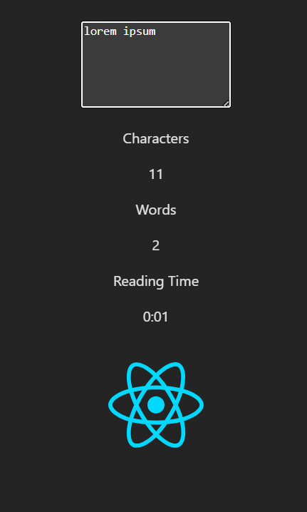

# Character Counter

## Table of Contents

- [About the Author](#author)
- [Reflection](#reflection)

## About The Authors

- **[Christian Blunt](https://www.linkedin.com/in/christiangblunt/)**

## Reflection

### 1. How did you handle state updates when the text changed?

State updates were handled by lifting the text state up to the `CharacterCounter` component and passing a callback function down to the `TextInput` component. Whenever the user typed into the textarea, the `onTextChange` callback was triggered, updating the text state using `useState`. This ensured a single source of truth for the text while allowing child components to remain stateless and focused on their responsibilities. State updates automatically triggered re-renders, keeping the UI in sync with user input.

### 2. What considerations did you make when calculating reading time?

Reading time was calculated based on word count rather than character count to better reflect real-world reading behavior. I accounted for edge cases such as empty input to avoid division errors and ensured the calculation remained lightweight to support real-time updates. The logic was kept simple and deterministic so it could run efficiently on every keystroke without negatively impacting performance.

### 3. How did you ensure the UI remained responsive during rapid text input?

To keep the UI responsive, I avoided unnecessary state variables and recalculations by deriving statistics directly from the text state. Each update relied on straightforward string operations, which are inexpensive to compute. Component responsibilities were clearly separated so only the components dependent on the updated state re-rendered, preventing excessive or unnecessary UI updates during rapid typing.

### 4. What challenges did you face when implementing the statistics calculations?

One of the main challenges was accurately calculating word count and reading time while handling edge cases such as extra spaces, line breaks, and empty input. Ensuring consistency between character count, word count, and reading time required careful string parsing and validation. Another challenge was maintaining readability and organization of the calculation logic while keeping it performant and easy to maintain.
